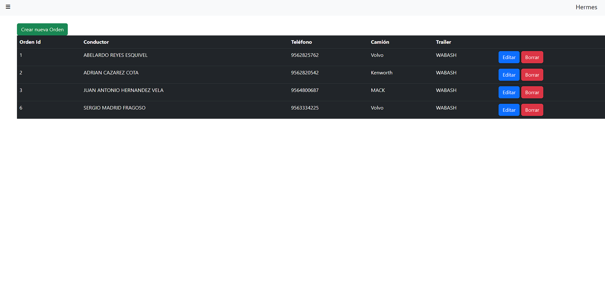
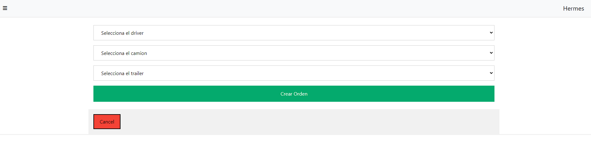
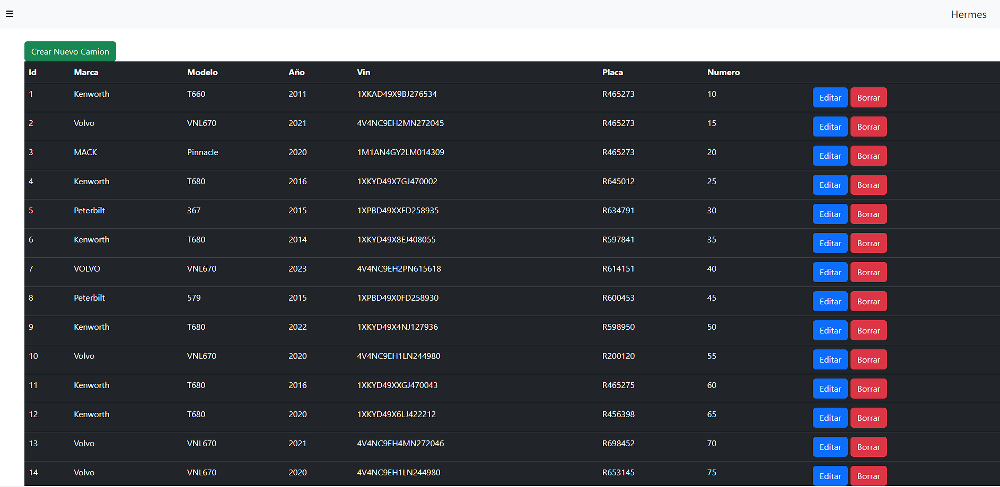
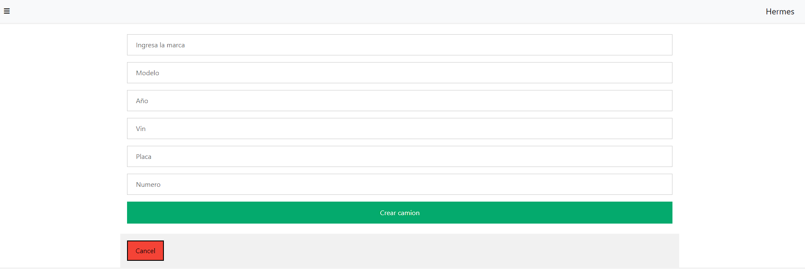

## HERMES LOGISRTICS V 2.01

https://github.com/maugh108/hermesV2

## Introducción 📋
Hermes logistics V 2.01

Este sistema en su version 2.01 nos permite desplegar la infomacion de una orden de trabajo con la infomacion de conductor, camion y numero de trailer.

En la parte de la esquina superior izquierda podemos ver un menu deplegable que apresionas nos va a motrar 4 opciones que son:

* Ordenes: es la pagina principal donde puese visualizar que ordenes han sido creadas.
* Camiones: en esta pagina podemos ver la informacion de los camiones que estan registrados.
* Trailer: en esta pagina podemos ver la informacion de los trailers que estan registrados.
* Conductores  en esta pagina podemos ver la informacion de los conductores que estan registrados.

En la pantalla principal llamada "Ordenes" podemos ver la informacion de las ordenes que se han agregado en forma de lista para poder visualizar la informacion de la orden.

* Podemos ver un boton en color verde color verde que dice "Crear una nueva orden" 

* Al presionar este boton nos mandara a una pantallas en donde nos va a solicitar la informacion que deseas agregar a la orden es decir que conductor, que camion y que trailer estan asignados a esta, se nos desplegara la informarcion que hemos agregado anteriormente.

* Tenemos que presionar el boton de crear para que se nos despliegue en nuestra pagina principal.

En la pagina de Camiones al momento de dar click se nos deplegara el listado de camiones que tienes registrados en tu compañia

* En esta pantalla podremos ver el boton de agregar "Crear Nuevo Camion"

Presinando este boton se abrira otra pantalla que nos va a solicitar la informacion del camion que queremos registrar

* Al presionar "Crear Camion" nos enviara a la pagina principal llamada "Ordenes"

Esta interancion es la misma en las siguientes 2 opciones que son Trailer y Conductores.

## Contribuyentes 🖇️

* Alberto Manuel Guajardo Quintanilla 
  https://github.com/AlbertoGuajardo22
 
* Mauricio García Hernández
   https://github.com/maugh108

## Versiones 📌
Version 2.01

## Construido con 🛠️
* HTML
* CSS
* NODE
* EXPRESS
* HANDLEBARS
* SQL

## Autores ✒️
* Alberto Manuel Guajardo Quintanilla 
  https://github.com/AlbertoGuajardo22
 
* Mauricio García Hernández
   https://github.com/maugh108

